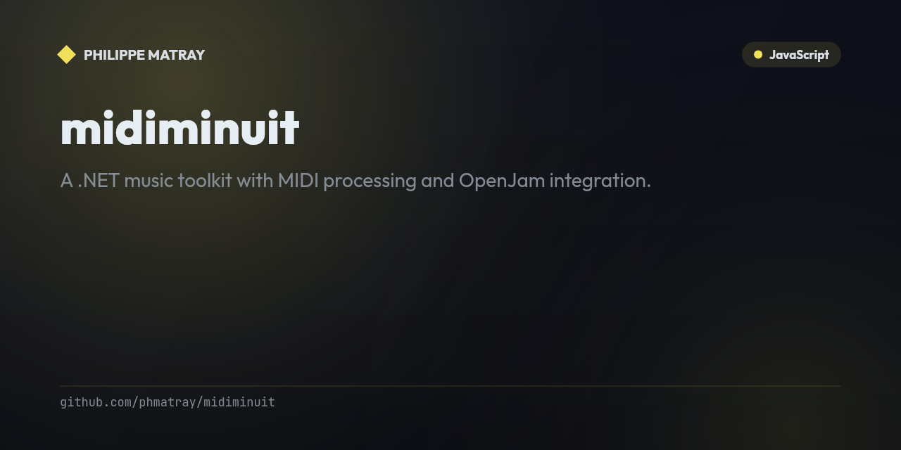

# midiminuit

> A .NET music toolkit with MIDI processing and OpenJam integration.

## Description

Midiminuit is a .NET-based music application providing MIDI processing, music theory utilities, and integration with the OpenJam platform. It includes a drum pad machine, interval calculator, and musical note handling.

## Stack / Tech
- .NET / C#
- MIDI processing
- Music theory

## Getting Started

```bash
dotnet run --project OpenJam.Startup/OpenJam.Startup.csproj
```

## License
MIT
