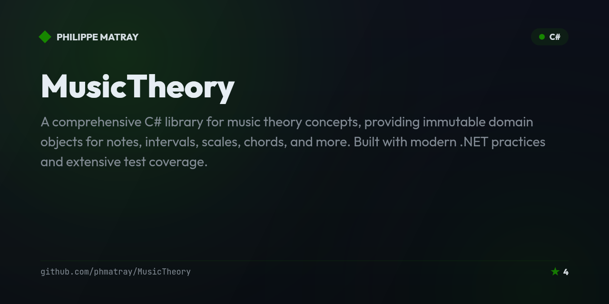

# Music .NET

<!-- portfolio-badges:start -->
<!-- Identity -->
[](https://github.com/phmatray/music-dotnet)

[](https://github.com/phmatray/music-dotnet/stargazers)
[](https://github.com/phmatray/music-dotnet/network/members)
[](https://github.com/phmatray/music-dotnet/blob/HEAD/LICENSE)

<!-- Activity -->
[](https://github.com/phmatray/music-dotnet/issues)
[](https://github.com/phmatray/music-dotnet/pulls)
[](https://github.com/phmatray/music-dotnet/commits)
<!-- portfolio-badges:end -->

<!-- portfolio-toc:start -->

## Table of Contents

- [Projects](#projects)
- [Features](#features)
- [Usage](#usage)
- [History](#history)
- [License](#license)

<!-- portfolio-toc:end -->


> **Music and audio for .NET** — a theory library, a chord engine, MIDI tooling and
> Web Audio bindings, consolidated in one place (full git history preserved).

## Projects

| Path | What it is | From |
|---|---|---|
| [`theory/`](theory) | **Music-theory library** — immutable models for notes, intervals, scales, chords & progressions; frequency, MIDI, enharmonic equivalence, fluent APIs | `phmatray/MusicTheory` ★ |
| [`chord-engine/`](chord-engine) | **Chord generation, analysis & Blazor visualization** | `phmatray/ChordEngine` |
| [`midi/`](midi) | **MIDI processing** toolkit with OpenJam integration | `phmatray/midiminuit` |
| [`webaudio-interop/`](webaudio-interop) | **Web Audio API** bindings for Blazor (C# ⇄ TS/JS interop) | `phmatray/WebAudioInterop` |

## Features

- **A music-theory core** (`theory/`) the other projects can build on
- **Complementary pieces** — chords, MIDI, Web Audio, and a player — not overlapping rewrites
- **One home** — shared issues, discussions and history for all .NET music/audio work

## Usage

```bash
git clone https://github.com/phmatray/music-dotnet.git
cd music-dotnet
dotnet build music-dotnet.slnx
dotnet test  music-dotnet.slnx
```

## History

Each folder was merged with **full git history preserved** (`git subtree`). The
original repositories are archived and redirect here.

<!-- portfolio-techstack:start -->

## Tech Stack

- **.NET 10** (single target across the repo)
- Microsoft.AspNetCore.Components.WebAssembly (Blazor)
- MudBlazor
- xunit.v3 on Microsoft.Testing.Platform · Shouldly · bunit

Build configuration is centralised at the repo root: `Directory.Build.props` sets the
target framework, `Directory.Packages.props` pins every package version (Central
Package Management), and `global.json` pins the SDK.

`midi/` is archived and not built — it targets `netcoreapp1.1` and UWP
(`Microsoft.NETCore.UniversalWindowsPlatform`, MvvmLight), and opts out of the root
build configuration via its own `Directory.Build.props`.

<!-- portfolio-techstack:end -->

<!-- portfolio-roadmap:start -->

## Roadmap

Planned work and known limitations are tracked in the [open issues](https://github.com/phmatray/music-dotnet/issues). Contributions toward them are welcome.

<!-- portfolio-roadmap:end -->

## License

MIT — see [`LICENSE`](LICENSE).

---

<!-- portfolio-sections:start -->

## Contributing

Contributions are welcome. Open an issue first to discuss any significant change.

1. Fork the repository and create your branch (`git checkout -b feat/my-feature`)
2. Commit your changes (`git commit -m 'feat: ...'`)
3. Push the branch and open a Pull Request

<!-- portfolio-sections:end -->

<!-- portfolio-nugetkeep:start -->
---
Built by [Atypical Consulting](https://www.atypical.consulting). We also make
[NuGetKeep](https://nugetkeep.com/?utm_source=github-readme&utm_medium=readme&utm_campaign=launch-2026-07),
a self-hosted NuGet server with supply-chain quarantine.
<!-- portfolio-nugetkeep:end -->
